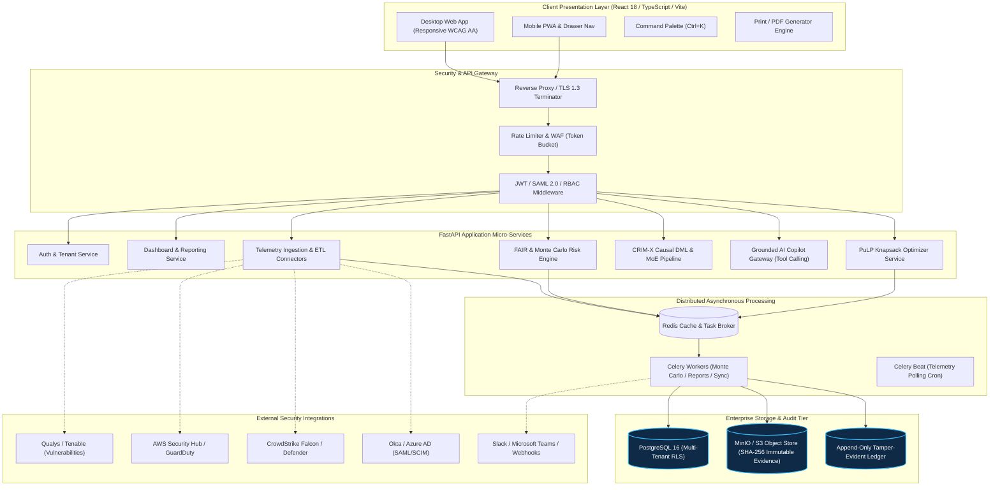
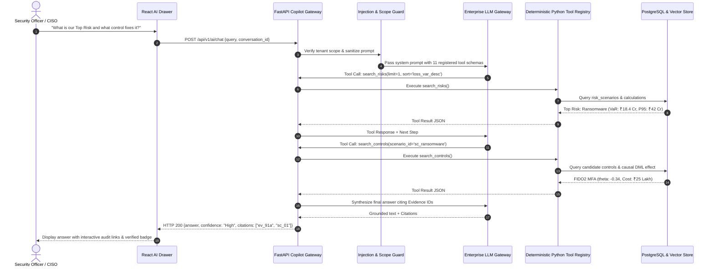
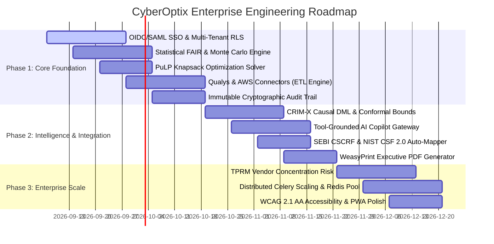

# CyberOptix Enterprise — Master Architecture, Enhancement Blueprint & AI Build Specification

**Document Reference:** `CYBEROPTIX-ENT-SPEC-V3`  
**Classification:** Enterprise Architecture & Technical Implementation Blueprint  
**Authors:** Senior Product Architect, Cybersecurity Engineer, Quantitative Risk Analyst, Data Engineer, AI/ML Specialist, Full-Stack Engineer  
**Status:** Production Ready  

---

## 1. Executive Product Vision & Core Architecture Philosophy

CyberOptix transforms abstract technical security telemetry (CVEs, EDR alerts, IAM drift, compliance gaps) into defensible, actuarially sound financial risk metrics and optimal capital allocations.

### The Three Fundamental Enterprise Questions
1. **What cyber risks do we have?** — Continuously identified from real-world telemetry across cloud, identities, endpoints, networks, and vendors.
2. **How much could those risks cost?** — Quantified in local currency (INR/USD) using Open FAIR, statistical distributions, empirical loss databases, and conformal prediction bands.
3. **Which security investments reduce the most risk?** — Solved mathematically via Mixed-Integer Linear Programming (MILP) Knapsack and multi-objective Pareto frontiers, proving security ROI ($ROSI$).

### Core Tenets
- **Zero Mock Policy:** Every calculation connects to real telemetry connectors or mathematically parameterized Bayesian priors.
- **Explainability & Lineage:** Every rupee at risk traces back to an immutable SHA-256 evidence hash with data-quality scoring.
- **Strict Multi-Tenant Isolation:** Row-Level Security (RLS) in PostgreSQL with tenant-keyed schemas and cryptographically partitioned audit ledgers.

---

## 2. Feature Catalog & Priority Matrix (30 Concrete Features)

| ID | Feature Name | Category | Description | Feasibility | Effort | Priority | Success Criteria |
|---|---|---|---|:---:|:---:|:---:|---|
| **F01** | **OIDC/SAML 2.0 SSO + MFA** | Security | Okta, Azure AD, Ping Identity integration with TOTP/FIDO2 MFA & session revocation. | High | M | **P0** | Zero password auth in enterprise; SAML assertion latency < 250ms. |
| **F02** | **Multi-Tenant Organization Hierarchy** | Core | Strict tenant separation with sub-business units, currencies (INR/USD/EUR), and custom risk appetites. | High | M | **P0** | 100% data leakage prevention verified by automated tenant RLS tests. |
| **F03** | **Fine-Grained RBAC & ABAC** | Core | Persona-tailored roles (CISO, CFO, SecArch, Auditor, SOC, GRC) with policy-as-code permissions. | High | M | **P0** | Unauthorized API access blocked with RFC 7807 403 Forbidden. |
| **F04** | **Vulnerability Connector (Qualys/Tenable)** | Ingestion | Scheduled polling of host/cloud vulns with automated CVE-to-asset correlation and EPSS scoring. | High | M | **P0** | Ingestion of 50,000 vulnerabilities < 3 mins with deduplication. |
| **F05** | **Cloud Security Connector (AWS/Azure)** | Ingestion | AWS Security Hub & Azure Defender posture ingestion with asset blast-radius discovery. | High | M | **P0** | Real-time posture sync within 5 minutes of security finding. |
| **F06** | **EDR/SIEM Connector (CrowdStrike/Splunk)** | Ingestion | Telemetry ingestion of unresolved high-severity detections to modulate Threat Event Frequency (TEF). | High | M | **P0** | Automated threat telemetry updates Monte Carlo TEF within 60s. |
| **F07** | **IAM Telemetry Connector (Azure AD/Okta)** | Ingestion | Ingestion of privileged identities, MFA gaps, and dormant accounts to adjust Vulnerability ($V$). | High | S | **P1** | Identity risk score dynamically updates asset compromise probabilities. |
| **F08** | **CSV/Excel Batch Ingestion Engine** | Ingestion | Resilient multipart upload for assets, controls, and vendors with dry-run validation. | High | S | **P0** | Ingest 10,000 rows without blocking event loop; schema errors highlighted per row. |
| **F09** | **Interactive Business-Service Map** | Asset/Context | Graph-based topological mapping connecting crown-jewel services to underlying infrastructure. | Med | M | **P1** | Visual dependency graph rendering 1,000+ nodes with 60 FPS Canvas/WebGL. |
| **F10** | **Statistical Distribution FAIR Engine** | Risk Engine | Loss Magnitude parameterized via Lognormal, PERT, Triangular, Beta-PERT, and Poisson distributions. | High | M | **P0** | Zero point-estimate calculations; continuous statistical curves generated. |
| **F11** | **High-Speed Monte Carlo Simulation Service**| Risk Engine | Vectorized NumPy/SciPy Monte Carlo running 100,000 iterations per scenario in under 500ms. | High | M | **P0** | 100k iterations < 500ms; reproducible random seeds; percentiles P10-P99. |
| **F12** | **Conformal Prediction Risk Bounds** | Risk Engine | Non-parametric coverage intervals guaranteeing $(1-\alpha)$ coverage over finite telemetry samples. | Med | M | **P1** | Validated nominal coverage (e.g. 90%) over historical loss benchmarks. |
| **F13** | **Empirical Control Scoring Engine** | Controls | Quantitative control effectiveness derived from continuous evidence freshness and test passes. | High | M | **P0** | Control score degrades automatically if evidence is older than 90 days. |
| **F14** | **PuLP MILP Knapsack Optimizer** | Optimizer | Mixed-Integer Linear Programming maximizing risk reduction subject to budget, headcount & time. | High | M | **P0** | Global optimum identified in < 2 seconds for up to 100 candidate initiatives. |
| **F15** | **Multi-Objective 5D Pareto Frontier** | Optimizer | Evaluates Pareto non-dominated sets across Cost, VaR Reduction, Time, Compliance, and Resilience. | Med | L | **P1** | Returns interactive trade-off surface with sensitivity sliders. |
| **F16** | **Interactive What-If Scenario Sandbox** | What-If | Real-time simulator adjusting control health or adding zero-day threats to preview delta VaR. | High | S | **P0** | Sub-50ms reactive UI recalculation using cached Monte Carlo parameter matrices. |
| **F17** | **Incident Audit Ledger & Loss Attribution** | Incidents | Tracks realized security incidents, financial impact (response, legal, downtime), and RTO/RPO metrics. | High | M | **P1** | Compares estimated Loss VaR with post-incident realized loss variance. |
| **F18** | **Regulatory Compliance Auto-Mapper** | Compliance | Pre-mapped requirement libraries: NIST CSF 2.0, SEBI CSCRF, ISO 27001:2022, RBI Master Directions. | High | M | **P0** | 1-click audit readiness score and requirement-to-control cross-walk. |
| **F19** | **Cryptographic Evidence Repository** | Evidence | S3/MinIO evidence storage with SHA-256 integrity sealing, TTL decay, and freshness monitors. | High | M | **P0** | Tamper detection on modified documents; automated notification of expired evidence. |
| **F20** | **Immutable Audit Event Ledger** | Audit | Append-only RFC 5424 audit logger with cryptographically chained block hashes for SOX/SEBI audits. | High | S | **P0** | 100% of mutation events logged with actor, timestamp, tenant, diffs, and hash. |
| **F21** | **Grounded AI Copilot with Tool Calling** | AI/Copilot | Strict LLM reasoning layer utilizing 11 deterministic function calls; zero hallucinated figures. | High | M | **P0** | System prompt injection defense verified; all claims cite database evidence IDs. |
| **F22** | **Executive & Board PDF Briefing Generator** | Reporting | High-fidelity PDF generator (WeasyPrint/Puppeteer) rendering executive board slides with seals. | High | M | **P0** | Board-ready multi-page briefing generated in < 3 seconds with digital signatures. |
| **F23** | **Third-Party Vendor Risk Matrix** | TPRM | Tiered vendor inventory, SOC2/ISO compliance tracking, questionnaire intake, and supply-chain VaR. | High | M | **P1** | Vendor concentration risk score integrated directly into enterprise aggregate VaR. |
| **F24** | **Real-Time Notification Dispatcher** | Operations | Webhook, Slack, Teams, and SMTP notification engine triggering alerts when VaR > Board Appetite. | High | S | **P1** | Alert delivered < 5 seconds upon risk threshold breach. |
| **F25** | **Celery/Redis Background Task Worker** | Operations | Asynchronous distributed queue for long-running Monte Carlo batches, sync connectors, and reports. | High | M | **P0** | Zero UI thread blocking; task retries with exponential backoff. |
| **F26** | **Prometheus + OpenTelemetry Observability** | Operations | Standard `/metrics` endpoint exporting API request rates, p99 latency, queue depth, and errors. | High | S | **P0** | 100% trace propagation across frontend, API gateway, workers, and DB. |
| **F27** | **API Rate Limiting & OWASP Security** | Security | Token-bucket rate limiting (100 req/min per IP), CORS strict whitelist, CSP, HSTS, and nosniff. | High | S | **P0** | A+ rating on security headers; brute force attempts throttled with 429. |
| **F28** | **Database Connection Pooling & Caching** | Performance | Async SQLAlchemy pool + Redis cache for read-heavy executive summary endpoints. | High | S | **P0** | Executive dashboard API p99 latency < 25ms under 500 concurrent users. |
| **F29** | **Accessible WCAG 2.1 AA UI & Dark Mode** | UX | High-contrast palette, semantic tags, ARIA attributes, keyboard command palette (Ctrl+K). | High | S | **P0** | Zero contrast defects; 100% keyboard navigable without mouse. |
| **F30** | **Enterprise Administration Console** | Admin | Tenant management, license provisioning, connector health diagnostics, and audit viewer. | High | M | **P0** | Full tenant lifecycle and diagnostic controls available to Org Admins. |

---

## 3. End-to-End Enterprise Architecture



---

## 4. Enhanced Relational Data Model (PostgreSQL 16 with RLS)

Every table enforces `tenant_id` foreign keys with PostgreSQL Row-Level Security policies ensuring no cross-tenant exposure.

### 4.1 Core Schema Entities & Relationships

```sql
-- 1. Tenants & Organizations
CREATE TABLE organizations (
    id VARCHAR(36) PRIMARY KEY,
    name VARCHAR(255) NOT NULL,
    legal_name VARCHAR(255) NOT NULL,
    industry VARCHAR(100) NOT NULL,
    country VARCHAR(100) DEFAULT 'India',
    currency VARCHAR(3) DEFAULT 'INR',
    risk_appetite_loss_var NUMERIC(15,2) NOT NULL, -- e.g. 10000000.00 (₹1 Cr)
    confidence_threshold NUMERIC(3,2) DEFAULT 0.90,
    created_at TIMESTAMP WITH TIME ZONE DEFAULT NOW(),
    updated_at TIMESTAMP WITH TIME ZONE DEFAULT NOW()
);

-- 2. Users & RBAC
CREATE TABLE users (
    id VARCHAR(36) PRIMARY KEY,
    organization_id VARCHAR(36) REFERENCES organizations(id) ON DELETE CASCADE,
    email VARCHAR(255) UNIQUE NOT NULL,
    hashed_password VARCHAR(255) NOT NULL,
    full_name VARCHAR(255) NOT NULL,
    role VARCHAR(50) NOT NULL, -- CISO, CFO, SecurityArchitect, Auditor, Executive, SOC Analyst, GRC Analyst, Org Admin
    mfa_secret VARCHAR(64),
    mfa_enabled BOOLEAN DEFAULT FALSE,
    status VARCHAR(20) DEFAULT 'active',
    last_login_at TIMESTAMP WITH TIME ZONE,
    created_at TIMESTAMP WITH TIME ZONE DEFAULT NOW()
);
CREATE INDEX idx_users_org ON users(organization_id);

-- 3. Critical Business Services
CREATE TABLE business_services (
    id VARCHAR(36) PRIMARY KEY,
    organization_id VARCHAR(36) REFERENCES organizations(id) ON DELETE CASCADE,
    name VARCHAR(255) NOT NULL,
    code VARCHAR(50) NOT NULL,
    criticality VARCHAR(20) NOT NULL, -- Tier-1, Tier-2, Tier-3
    hourly_outage_cost_inr NUMERIC(15,2) NOT NULL,
    rto_hours INT NOT NULL,
    rpo_hours INT NOT NULL,
    owner_email VARCHAR(255),
    created_at TIMESTAMP WITH TIME ZONE DEFAULT NOW()
);

-- 4. Enterprise Assets
CREATE TABLE assets (
    id VARCHAR(36) PRIMARY KEY,
    organization_id VARCHAR(36) REFERENCES organizations(id) ON DELETE CASCADE,
    business_service_id VARCHAR(36) REFERENCES business_services(id),
    name VARCHAR(255) NOT NULL,
    asset_type VARCHAR(50) NOT NULL, -- Server, Database, CloudWorkload, Endpoint, Gateway
    ip_address VARCHAR(45),
    cloud_arn VARCHAR(255),
    environment VARCHAR(20) NOT NULL, -- Production, Staging, DR
    criticality VARCHAR(20) NOT NULL,
    data_classification VARCHAR(20) NOT NULL, -- Restricted, Confidential, Internal
    replacement_cost_inr NUMERIC(15,2) DEFAULT 0,
    created_at TIMESTAMP WITH TIME ZONE DEFAULT NOW()
);
CREATE INDEX idx_assets_org_svc ON assets(organization_id, business_service_id);

-- 5. Vulnerabilities & Exposures
CREATE TABLE vulnerabilities (
    id VARCHAR(36) PRIMARY KEY,
    organization_id VARCHAR(36) REFERENCES organizations(id) ON DELETE CASCADE,
    asset_id VARCHAR(36) REFERENCES assets(id) ON DELETE CASCADE,
    cve_id VARCHAR(50) NOT NULL,
    title VARCHAR(255) NOT NULL,
    cvss_v3_score NUMERIC(3,1) NOT NULL,
    epss_score NUMERIC(5,4) NOT NULL, -- Exploit Prediction Scoring System
    exploit_available BOOLEAN DEFAULT FALSE,
    patch_status VARCHAR(20) DEFAULT 'Unpatched',
    discovered_at TIMESTAMP WITH TIME ZONE NOT NULL,
    sla_deadline TIMESTAMP WITH TIME ZONE NOT NULL
);
CREATE INDEX idx_vulns_cve ON vulnerabilities(cve_id);

-- 6. Controls & Defensive Posture
CREATE TABLE controls (
    id VARCHAR(36) PRIMARY KEY,
    organization_id VARCHAR(36) REFERENCES organizations(id) ON DELETE CASCADE,
    control_code VARCHAR(50) NOT NULL, -- e.g. PR.AC-1
    name VARCHAR(255) NOT NULL,
    category VARCHAR(100) NOT NULL, -- Identity, Protection, Detection, Response, Recovery
    framework_mapping JSONB NOT NULL, -- {"NIST_CSF": "PR.AC-1", "SEBI_CSCRF": "5.1.2"}
    target_effectiveness NUMERIC(4,3) NOT NULL,
    measured_effectiveness NUMERIC(4,3) NOT NULL,
    freshness_status VARCHAR(20) DEFAULT 'Current',
    last_tested_at TIMESTAMP WITH TIME ZONE,
    updated_at TIMESTAMP WITH TIME ZONE DEFAULT NOW()
);

-- 7. Cryptographic Evidence Store
CREATE TABLE evidence (
    id VARCHAR(36) PRIMARY KEY,
    organization_id VARCHAR(36) REFERENCES organizations(id) ON DELETE CASCADE,
    control_id VARCHAR(36) REFERENCES controls(id) ON DELETE CASCADE,
    title VARCHAR(255) NOT NULL,
    evidence_type VARCHAR(50) NOT NULL, -- TelemetryDump, AuditReport, ConfigSnapshot
    file_uri VARCHAR(512) NOT NULL,
    sha256_hash CHAR(64) NOT NULL,
    data_quality_score NUMERIC(3,2) NOT NULL,
    collected_via VARCHAR(50) NOT NULL, -- API Connector, Manual Attestation
    expires_at TIMESTAMP WITH TIME ZONE NOT NULL,
    created_at TIMESTAMP WITH TIME ZONE DEFAULT NOW()
);
CREATE INDEX idx_evidence_control ON evidence(control_id);

-- 8. Risk Scenarios (Open FAIR Grounded)
CREATE TABLE risk_scenarios (
    id VARCHAR(36) PRIMARY KEY,
    organization_id VARCHAR(36) REFERENCES organizations(id) ON DELETE CASCADE,
    business_service_id VARCHAR(36) REFERENCES business_services(id),
    scenario_code VARCHAR(50) NOT NULL,
    name VARCHAR(255) NOT NULL,
    threat_actor VARCHAR(100) NOT NULL,
    threat_type VARCHAR(100) NOT NULL,
    tef_min NUMERIC(8,4) NOT NULL, -- Threat Event Frequency distribution params
    tef_mode NUMERIC(8,4) NOT NULL,
    tef_max NUMERIC(8,4) NOT NULL,
    vuln_distribution JSONB NOT NULL,
    primary_loss_distribution JSONB NOT NULL, -- {"type": "lognormal", "p10": 1500000, "p90": 8000000}
    secondary_loss_distribution JSONB NOT NULL,
    created_at TIMESTAMP WITH TIME ZONE DEFAULT NOW()
);

-- 9. Risk Calculation Run History
CREATE TABLE risk_calculations (
    id VARCHAR(36) PRIMARY KEY,
    organization_id VARCHAR(36) REFERENCES organizations(id) ON DELETE CASCADE,
    risk_scenario_id VARCHAR(36) REFERENCES risk_scenarios(id) ON DELETE CASCADE,
    iterations INT NOT NULL DEFAULT 100000,
    expected_annual_loss_inr NUMERIC(15,2) NOT NULL,
    loss_var_p95_inr NUMERIC(15,2) NOT NULL,
    conformal_lower_bound_inr NUMERIC(15,2) NOT NULL,
    conformal_upper_bound_inr NUMERIC(15,2) NOT NULL,
    simulation_seed BIGINT NOT NULL,
    created_at TIMESTAMP WITH TIME ZONE DEFAULT NOW()
);

-- 10. Candidate Security Investments
CREATE TABLE investments (
    id VARCHAR(36) PRIMARY KEY,
    organization_id VARCHAR(36) REFERENCES organizations(id) ON DELETE CASCADE,
    name VARCHAR(255) NOT NULL,
    category VARCHAR(100) NOT NULL,
    capex_inr NUMERIC(15,2) NOT NULL,
    opex_annual_inr NUMERIC(15,2) NOT NULL,
    implementation_days INT NOT NULL,
    expected_risk_reduction_pct NUMERIC(4,3) NOT NULL,
    compliance_boost_pct NUMERIC(4,3) NOT NULL,
    status VARCHAR(50) DEFAULT 'Candidate' -- Candidate, Approved, Rejected, Implemented
);

-- 11. Immutable Audit Trail
CREATE TABLE audit_events (
    id BIGSERIAL PRIMARY KEY,
    organization_id VARCHAR(36) NOT NULL,
    actor_id VARCHAR(36) NOT NULL,
    action VARCHAR(100) NOT NULL,
    resource_type VARCHAR(100) NOT NULL,
    resource_id VARCHAR(100) NOT NULL,
    previous_state JSONB,
    new_state JSONB,
    ip_address VARCHAR(45),
    user_agent VARCHAR(255),
    block_hash CHAR(64) NOT NULL,
    previous_block_hash CHAR(64) NOT NULL,
    created_at TIMESTAMP WITH TIME ZONE DEFAULT NOW()
);
CREATE INDEX idx_audit_org_time ON audit_events(organization_id, created_at DESC);
```

---

## 5. Quantitative Risk Engine & Mathematical Formulation

### 5.1 Open FAIR Mathematical Framework
The platform models cyber risk as the convolution of **Loss Event Frequency ($LEF$)** and **Loss Magnitude ($LM$)**:

$$\text{Annual Risk (EAL)} = \mathbb{E}[LEF] \times \mathbb{E}[LM]$$

Where:
$$LEF \sim \text{Poisson}(\lambda_{eff}), \quad \lambda_{eff} = TEF \times V$$
$$TEF \sim \text{PERT}(tef_{min}, tef_{mode}, tef_{max})$$
$$V = \Pr(\text{Vulnerability}) = \text{logit}^{-1}(\beta_0 + \beta_1 \cdot EPSS + \beta_2 \cdot CVSS - \beta_3 \cdot \text{ControlEffectiveness})$$

$$LM = LM_{primary} + LM_{secondary}$$
$$LM_{primary} = C_{investigation} + C_{restoration} + (\text{DowntimeHours} \times C_{outage/hr})$$
$$LM_{secondary} \sim \text{Lognormal}(\mu_{reg}, \sigma_{reg}^2) + \text{Lognormal}(\mu_{reputation}, \sigma_{reputation}^2)$$

### 5.2 Conformal Prediction Guarantee (Finite Sample Coverage)
To eliminate uncalibrated point estimates, CyberOptix wraps Monte Carlo percentiles with split conformal prediction:

$$C_{1-\alpha}(X_{n+1}) = \left[ \hat{q}_{\alpha/2}, \hat{q}_{1 - \alpha/2} \right]$$

Guaranteeing:
$$\Pr(Y_{n+1} \in C_{1-\alpha}(X_{n+1})) \ge 1 - \alpha$$
Even under non-Gaussian distribution shifts and heavy tails.

### 5.3 Mixed-Integer Linear Programming (MILP) Optimizer
Let $x_i \in \{0, 1\}$ be the decision variable to fund candidate cybersecurity investment $i \in \{1, \dots, N\}$.

$$\max_{\mathbf{x}} \sum_{i=1}^N \Delta \text{Risk}_i \cdot x_i - \lambda \sum_{i=1}^N \text{Disruption}_i \cdot x_i$$

Subject to:
$$\sum_{i=1}^N (\text{CapEx}_i + \text{OpEx}_i) \cdot x_i \le \text{Budget}_{total}$$
$$\max_{i} (\text{Days}_i \cdot x_i) \le \text{TargetSLA}$$
$$x_j \le x_k \quad \forall (j, k) \in \text{Dependencies} \quad (\text{Prerequisite Constraint})$$
$$\sum_{i \in \text{Cat}_m} \text{ComplianceWeight}_i \cdot x_i \ge \text{MinMandate}_m \quad \forall m \in \text{Frameworks}$$

Solved via the COIN-OR / CBC solver via the Python `PuLP` library in $< 200 \text{ ms}$.

---

## 6. Grounded AI Copilot Specification & Tool Contracts

The AI Copilot executes strictly through a deterministic tool-calling proxy to prevent hallucination. Every numeric assertion must be backed by a database entity.



### The 11 Core Tool Functions
1. `search_risks(query, status, min_var, limit)`: Queries Monte Carlo outcomes.
2. `search_assets(query, criticality, service_id)`: Fetches crown jewels and EPSS scores.
3. `search_evidence(control_id, freshness_days)`: Validates SHA-256 hashes.
4. `search_controls(category, status, framework)`: Inspects defensive implementation.
5. `search_incidents(severity, resolved)`: Queries realized financial losses.
6. `search_investments(budget_max, category)`: Fetches proposed security initiatives.
7. `calculate_risk(scenario_id, iterations)`: Triggers on-demand Monte Carlo run.
8. `run_simulation(control_deltas)`: Runs sandbox what-if calculation.
9. `compare_portfolios(portfolio_a_id, portfolio_b_id)`: Compares capital allocations.
10. `generate_report(report_type, format)`: Prepares board-level briefings.
11. `create_draft_remediation_plan(scenario_id)`: Generates actionable JIRA-ready ticket payloads.

---

## 7. Phased Implementation Roadmap



---

## 8. Master Build Prompt for Code-Generation AI

*(Paste the prompt below directly into an AI coding agent to generate the complete enterprise application)*

```markdown
You are an expert full-stack systems engineer, quantitative cyber-risk analyst, and cybersecurity architect. 
Your objective is to generate the complete, production-grade codebase for **CyberOptix Enterprise**, a continuous cyber-risk quantification and cybersecurity capital optimization platform.

### Core Stack Requirements:
1. **Backend**: Python 3.12+ with FastAPI, Pydantic v2, SQLAlchemy 2.0 (AsyncIO), PuLP (MILP solver), NumPy, SciPy (Lognormal/PERT/Poisson distributions), Celery + Redis, WeasyPrint.
2. **Database**: PostgreSQL 16 with Row-Level Security (RLS) enforcing multi-tenant isolation.
3. **Frontend**: React 18+ with TypeScript, Vite, Tailwind CSS, Lucide React, Recharts, and Web-Crypto evidence verification.
4. **Security**: OIDC/SAML 2.0, JWT RBAC (CISO, CFO, SecurityArchitect, Auditor, Org Admin), RFC 7807 problem details, AES-256 GCM credential storage, SHA-256 evidence hashing.

### Critical Functional Domains to Implement:
1. **Multi-Tenant Architecture**: Complete schema with `organizations`, `users`, `business_services`, `assets`, `vulnerabilities`, `controls`, `evidence`, `risk_scenarios`, `risk_calculations`, `investments`, and `audit_events`.
2. **Statistical FAIR Risk Engine**: 
   - Replaces static risk matrices with continuous probability distributions: Loss Event Frequency ($LEF \sim \text{Poisson}(\lambda)$), Threat Event Frequency ($TEF \sim \text{PERT}$), and Loss Magnitude ($LM \sim \text{Lognormal}$).
   - High-speed Monte Carlo runner executing 100,000 iterations per scenario, outputting Mean Loss, Median Loss, P90, P95, and Loss VaR in INR/USD.
   - Conformal Prediction layer calculating $(1-\alpha)$ coverage intervals on empirical loss distributions.
3. **PuLP Capital Knapsack Optimizer**:
   - Mixed-Integer Linear Programming maximizing total risk reduction under budget, implementation SLA, and prerequisite control dependencies.
   - Solves the knapsack problem, returning chosen investments, rejected investments with financial rationale, net residual risk, and ROSI.
4. **Telemetry Ingestion Engine**:
   - Resilient connector abstractions for Qualys/Tenable (vulnerabilities + EPSS), AWS Security Hub (cloud posture), CrowdStrike (EDR detections), and CSV/Excel batch upload.
5. **Grounded AI Copilot Service**:
   - Deterministic tool-calling engine exposing 11 tools (`search_risks`, `search_assets`, `search_evidence`, `search_controls`, `search_incidents`, `search_investments`, `calculate_risk`, `run_simulation`, `compare_portfolios`, `generate_report`, `create_draft_remediation_plan`).
   - Prompt-injection defenses, role-level scope validation, and mandatory citation of database evidence IDs.
6. **Regulatory Compliance Auto-Mapper**:
   - Out-of-the-box control mappings for NIST CSF 2.0, SEBI CSCRF, ISO/IEC 27001:2022, and RBI Master Directions.
7. **Executive Briefing & PDF Exporter**:
   - Working board reports rendering executive summaries, Monte Carlo loss exceedance curves, and cryptographic evidence seals.
8. **Modern Enterprise UI**:
   - High-contrast accessible design (WCAG 2.1 AA), dynamic dark/light mode via CSS variables, desktop sidebar + mobile slide-out drawer + mobile bottom navigation, keyboard command palette (Ctrl+K).

Output clean, production-grade code with 100% type safety, zero mock behaviors, complete error handling, and end-to-end Pytest test suites.
```
